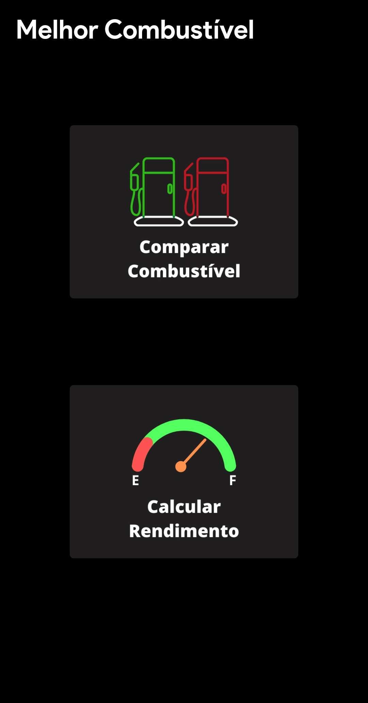
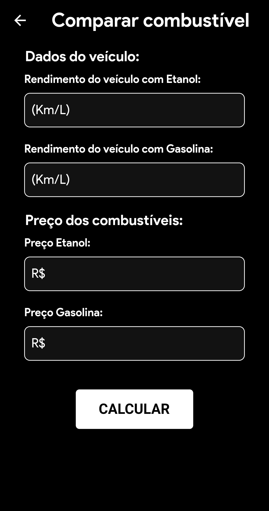
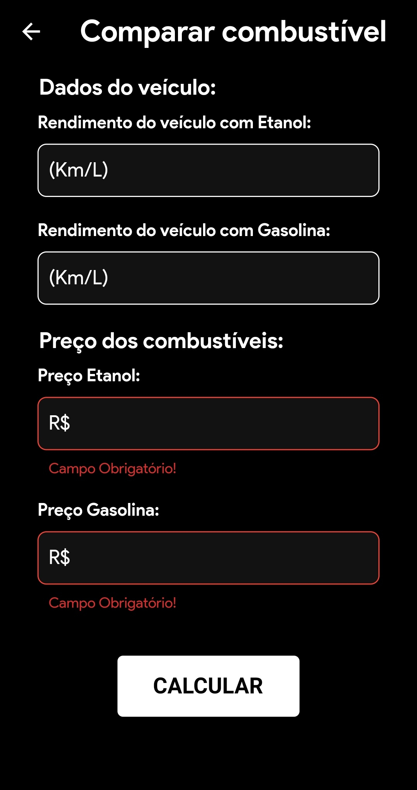
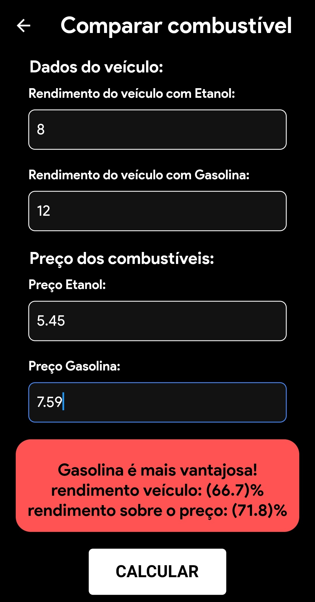

# Melhor Combustível

Um simples aplicativo feito em flutter para comparar qual combustível é mais viável
de acordo com o rendimento do veículo do usuário.

## 🖼️ Imagens

 

    
    
    
    
    
    
 

### Features

- [x] Calculo de rendimento do veículo
- [x] Comparação de qual combustível é mais vantajoso entre gasolina e etanol

### 🗂 Pacotes
- [Amazon Appstore](https://www.amazon.com.br/dp/B09PJSK7NX/ref=sr_1_1?__mk_pt_BR=%C3%85M%C3%85%C5%BD%C3%95%C3%91&crid=29PBLVKRG2I5J&keywords=comparador+de+combustivel&qid=1641215264&s=mobile-apps&sprefix=comparador+de+combustivel%2Cmobile-apps%2C111&sr=1-1)
- [arm64_v8a](https://github.com/fabriciolima77/comparador_combustivel/blob/master/APK/melhor_comb-arm64-v8a-2.0.apk)
- [armeabi_v7a](https://github.com/fabriciolima77/comparador_combustivel/blob/master/APK/melhor_comb-armeabi-v7a-2.0.apk)
- [AppBundle](https://github.com/fabriciolima77/comparador_combustivel/blob/master/APK/melhor_comb-bundle-2.0.aab)

### 🛠 Tecnologias

As seguintes ferramentas foram usadas na construção do projeto:

- [Dart](https://dart.dev/)
- [Flutter](https://flutter.dev/)
