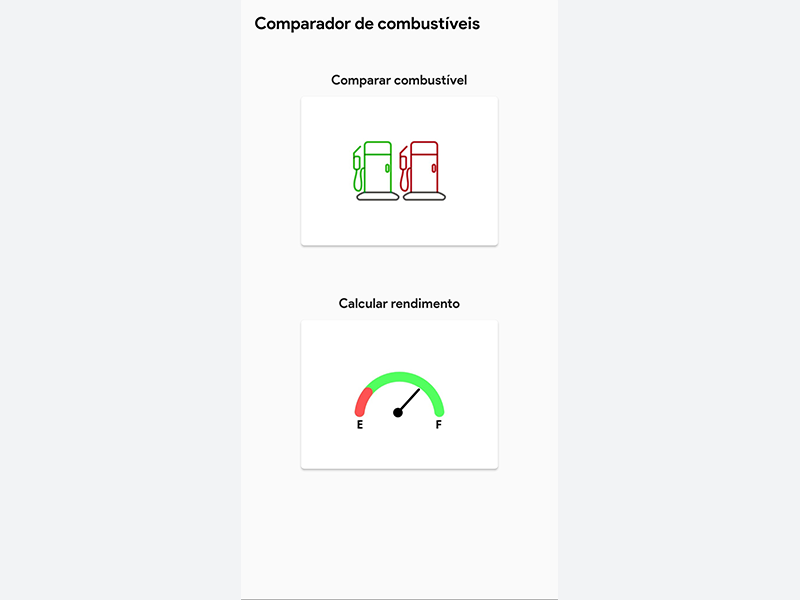
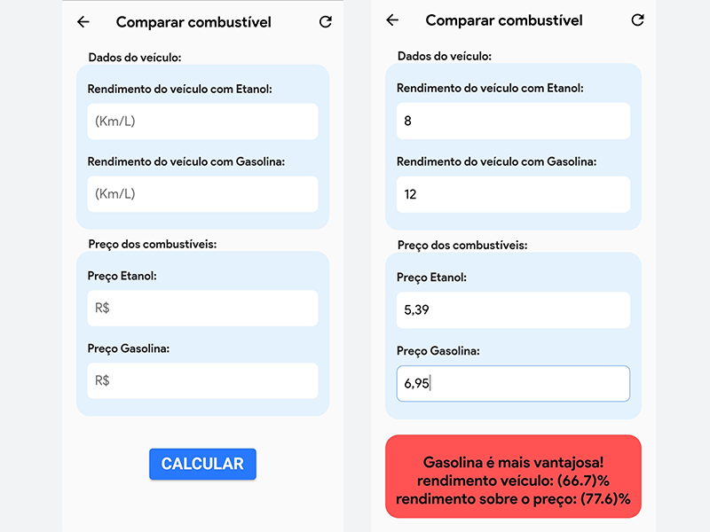
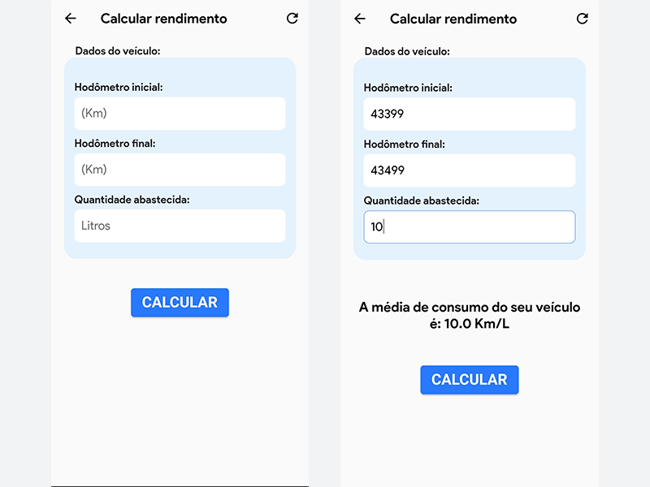

# Comparador de combustível

Um simples aplicativo feito em flutter para comparar qual combustível é mais viável
de acordo com o rendimento do veículo do usuário.

## 🖼️ Imagens

 

    
    
    
 

### Features

- [x] Calculo de rendimento do veículo
- [x] Comparação de qual combustível é mais vantajoso entre gasolina e etanol

### 🗂 Pacotes
- [Amazon Appstore](em breve...)

### 🛠 Tecnologias

As seguintes ferramentas foram usadas na construção do projeto:

- [Dart](https://dart.dev/)
- [Flutter](https://flutter.dev/)
- [mask_text_input_formatter: ^2.0.0](https://pub.dev/packages/mask_text_input_formatter)